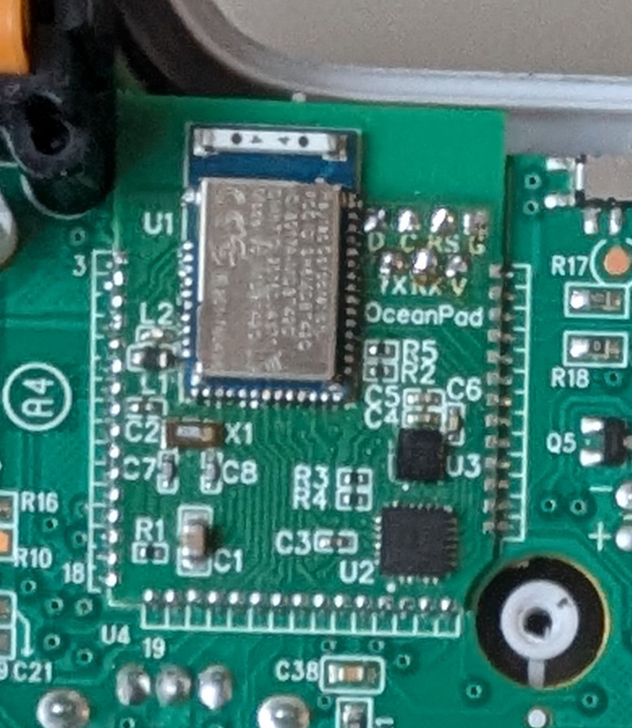
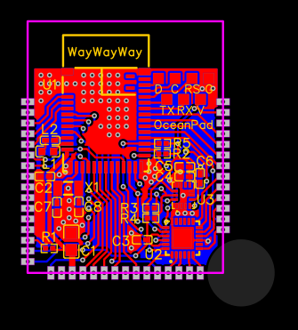

# OceanPad
**OceanPad** is a hardware modification project for the Logitech F710 gamepad. The original controller uses a "sandwich" PCB architecture featuring an nRF24LE1 MCU/transceiver. This project replaces that board entirely, transforming the classic F710 into a modern, low-latency **Bluetooth Low Energy (BLE)** gamepad with integrated motion controls.

## Modes of operaton
The original F710 features a physical D ⇔ X toggle switch, originally used to swap between DirectInput and XInput. In this project, the switch is repurposed to toggle between two distinct BLE HID modes:
* **X Position:** The controller impersonates an Xbox Series Controller.
* **D Position:** The controller mimics an 8BitDo Ultimate 2 Wireless. This controller is specifically chosen because it is the only BLE controller with native motion controls support recognized by Steam Input.
## hardware
The board integrates the following key components:
* [Raytac MDBT42Q-512KV2 module](https://www.raytac.com/product/ins.php?index_id=31). A high-performance module powered by the **Nordic nRF52832** (ARM Cortex-M4F).
* [TDK InvenSence ICM-42688-PC](https://invensense.tdk.com/products/motion-tracking/6-axis/icm-42688-p/). A high-precision 6-axis MEMS IMU enabling gyro aiming and motion gestures.
* PI4IOE5V6416ZDEX. A 16-port I2C GPIO expander. The expander was necessary due to the limited GPIO count on the nRF52832. Should've used nRF52840.
## Software
The firmware is written in C++ targeting the Zephyr RTOS. I am currently working on extracting the HID logic into a standalone library to simplify the creation of custom HID devices for the community.
## Known limitations
* **BLE Privacy/IRK:** If the host computer uses BLE Privacy with Identity Resolving Keys (IRK), the controller cannot maintain active pairings for both modes (X and D) simultaneously. If paired in one mode the bond in another mode will be erased. This is a [documented limitation](https://github.com/zephyrproject-rtos/zephyr/pull/49634) within the current Zephyr stack. I am investigating a workaround to handle dual-identity pairing more gracefully.
## Hardware building
### Voard acquisition
I designed the board using EasyEDA. That's the last project I used this service for since I'm switching to KiCad. In the `doc` directory, you'll find the Gerber, BOM, and placement files to order production from any PCB fabrication site.
* **Note:** I have 4 spare boards left without the module soldered. If you're ever in **Belgrade** and want one, feel free to DM me.
### Modifying the controller
1. **Disassembly:** Remove batteries, unscrew, and remove the bottom case of a working Logitech F710.
2. **Desoldering:** Unsolder the motor (black/white) and bumper (white) wires. Unscrew the two white screws and remove the motherboard. Unscrew the left trigger assembly and unsolder it from the original board.
3. **Sandwich Removal:** Use a hot air gun and flux to carefully heat the original sandwich PCB edges and remove it.
4. **Soldering the Mod:** Solder the OceanPad board in place.
* **Correction:** I initially thought the pin pitch was 1.27mm, but it is actually 1.25mm. They are slightly misaligned but functional.
5. **Debug Wiring:** Solder GND, Vref, SWDIO, SWCLK, and Reset to the board (add TX/RX if you need serial logs while playing with the firmware).
6. **Reassembly:** After flashing, unsolder the debug wires and reassemble in reverse order.
## Building and flashing
### Preparing environpent
Create and enter an empty directory and clone the repository. Enter `oceanpad`, then create and enter a fresh Python virtual environment. Install pip dependencies, then initialize and update west.
```
mkdir zephyr-tree
cd zephyr-tree
git clone https://github.com/vodka-bears/oceanpad
cd oceanpad
python3 -m venv .venv
source .venv/bin/activate
pip install -r pip_freeze.txt
west init -l .
west update
```
### Actual build
To compile the firmware for the OceanPad board:
```
west build -b oceanpad -- -DBOARD_ROOT=$PWD
```
### Flashing
You'll need a CMSIS-DAP adapter with a Vref pin since the F710 uses 2V for logic. I used a cheap pink Chinese CherryDAP from AliExpress. Solder GND, Vref, SWDIO, SWCLK, and Reset to the board, power it, and run:
```
west flash
```
